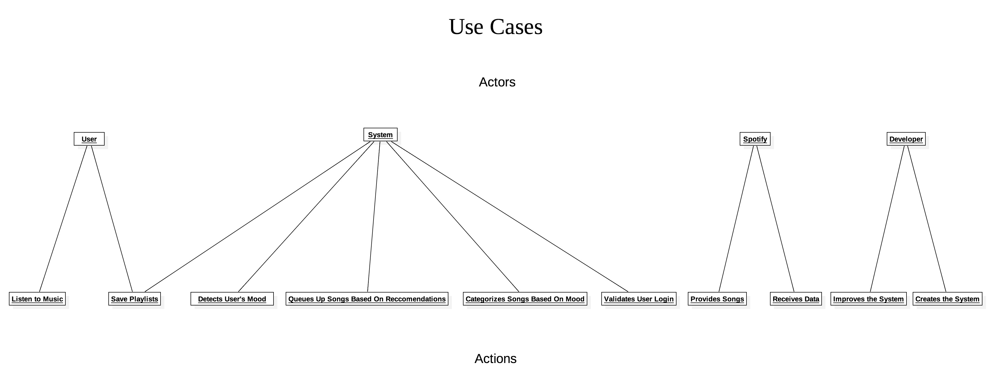

# Smoodify: a mood-based music player
## End-User Observation
### Persona #1: Amora Lyssa
Amora is a senior in college studying Media and Communications. She is particularly interested in film and television, with a focus on animation. Her favorite genres of music are alternative rock, pop, and pop rock. Her favorite bands are Panic! at the Disco and Gorillaz.

Amora listens to music both very passively but also selectively. When she’s walking down the street, she’ll listen to her Spotify saved music on shuffle without selecting. But when she sits down, she focuses on the song, hand-picking it. She doesn’t just let the music play: she’ll have a base of a couple songs, and from there she’ll select more songs to queue up. Occasionally her songs will sway her emotion, and she’ll get really into them. She is “very specific about [her] music,” making playlists to get ready to for a night out or to show her friends.

Amora finds that the beat and rhythm of a song affects her emotions in a much deeper way than lyrics do. She interprets music based on how it sounds, rather than lyrics. To her, they’re “just words.” She will often repeat the same song over and over again if she particularly enjoys it. Usually, she will find a new song before she stops listening to the old one. She queues up songs that she wants to listen to over a specific time and finds new songs sporadically, not usually based on the emotion of the song she’s “spamming.”

Smoodify would definitely enhance Amora’s music listening habits. The fact that she values music over lyrics hints at how instinctual, and, therefore, emotional, of an experience listening to music is for her. The ability to save playlists generated by a mood would facilitate the process she already goes through, and the choice to “spam” a song is still available - except now she can choose to use that song as a base to generate a mood playlist.

## Use Cases

**Title:** Listen to Music/Receive shuffled music according to User’s mood
**Actor:** The User (Customer)
**Scenario:**
⋅⋅⋅ Case 1 (Mood Shuffle): Customer uses the system as a normal music player on shuffle. System keeps track of the music the customer listens to often (through its lyrics). System will track tracks the user has skipped, to narrow down and pin point users’ current mood. System then plays music that match the user’s mood based off the songs he has previously listened to (in the shuffle mode). User then enjoys music that relates to his mood. 
⋅⋅⋅ Case 2 (No Shuffle): Customer uses the system as a normal music player.

**Title:** Save Playlists
**Actor:** The User (Customer), The System
**Scenario:** The user can choose to save the music he listened to during that session as a playlist. If they enjoyed that playlist, they may save it and categorize under a specific mood. Mood profiles can be built this way. The System saves the playlist to the User’s Spotify account.

**Title:** Recommend Music according to User’s mood
**Actor:** The System
**Scenario:** System detects User’s mood by keeping track of skips and “full listens” (> 50% of a song) and queues up songs from the user’s library accordingly. Recalibrates if it detects a shift in mood.

**Title:** Send Music to our app
**Actor:** Spotify (API)
**Scenario:** System requests song library from Spotify. Spotify then sends its songs and its data to the system. System then receives the data and plays the songs from Spotify on its own System. Precondition: User must have Spotify Premium

**Title:** Constantly Update/Improve the System
**Actor:** Developer (Us)
**Scenario:** Developer keeps in constant contact with the Stakeholder to understand Stakeholder’s vision for the System. Developer (following this vision) creates the System. Developer checks with the Stakeholder with the finished System. Developer releases the System to its End-User. Developer receives feedback from its Users. Developer continues to update its System.

### Use Case Diagram

## Domain Modeling

